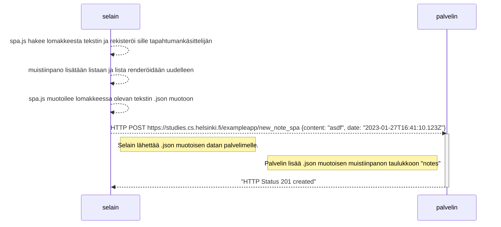

```mermaid
sequenceDiagram
    participant selain
    participant palvelin

    selain-->>selain: spa.js hakee lomakkeesta tekstin ja rekisteröi sille tapahtumankäsittelijän
    selain-->>selain: muistiinpano lisätään listaan ja lista renderöidään uudelleen
    selain-->>selain: spa.js muotoilee lomakkeessa olevan tekstin .json muotoon
    selain-->>palvelin: HTTP POST https://studies.cs.helsinki.fi/exampleapp/new_note_spa {content: "asdf", date: "2023-01-27T16:41:10.123Z"}
    activate palvelin
    Note right of selain: Selain lähettää .json muotoisen datan palvelimelle.
    Note left of palvelin: Palvelin lisää .json muotoisen muistiinpanon taulukkoon "notes"
    palvelin-->>selain: "HTTP Status 201 created"
    deactivate palvelin
    
```