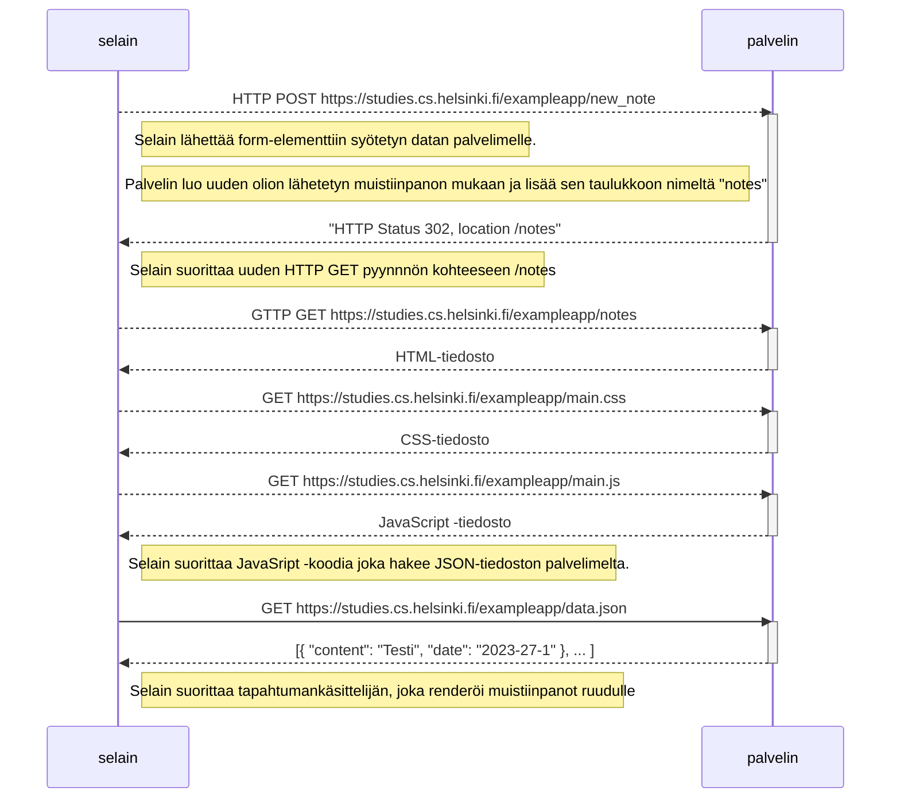

```mermaid
sequenceDiagram
    participant selain
    participant palvelin

    selain-->>palvelin: HTTP POST https://studies.cs.helsinki.fi/exampleapp/new_note
    activate palvelin
    Note right of selain: Selain lähettää form-elementtiin syötetyn datan palvelimelle.
    Note left of palvelin: Palvelin luo uuden olion lähetetyn muistiinpanon mukaan ja lisää sen taulukkoon nimeltä "notes"
    palvelin-->>selain: "HTTP Status 302, location /notes"
    deactivate palvelin
    Note right of selain: Selain suorittaa uuden HTTP GET pyynnnön kohteeseen /notes
    selain-->>palvelin:GTTP GET https://studies.cs.helsinki.fi/exampleapp/notes
    activate palvelin
    palvelin-->>selain: HTML-tiedosto
    deactivate palvelin
    selain-->>palvelin: GET https://studies.cs.helsinki.fi/exampleapp/main.css
    activate palvelin
    palvelin-->>selain: CSS-tiedosto
    deactivate palvelin
    selain-->> palvelin: GET https://studies.cs.helsinki.fi/exampleapp/main.js
    activate palvelin
    palvelin-->>selain: JavaScript -tiedosto
    deactivate palvelin
    Note right of selain: Selain suorittaa JavaSript -koodia joka hakee JSON-tiedoston palvelimelta.
    selain->>palvelin: GET https://studies.cs.helsinki.fi/exampleapp/data.json
    activate palvelin
    palvelin-->>selain: [{ "content": "Testi", "date": "2023-27-1" }, ... ]
    deactivate palvelin
    Note right of selain: Selain suorittaa tapahtumankäsittelijän, joka renderöi muistiinpanot ruudulle
```